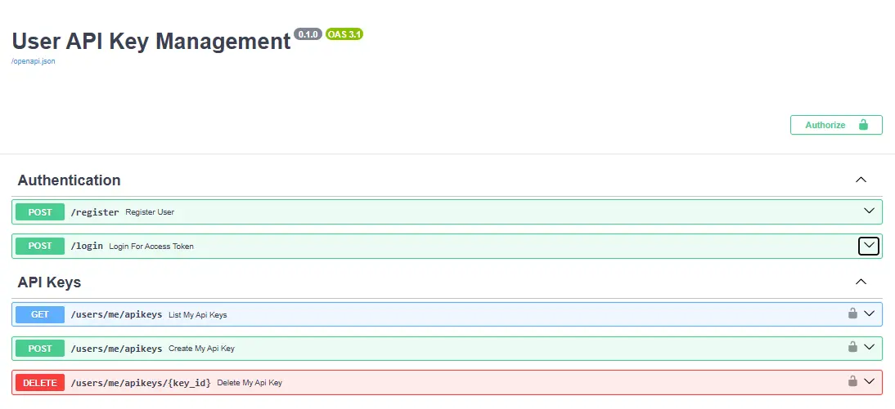
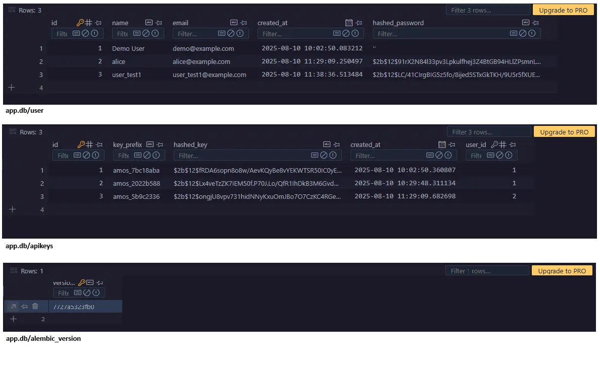

# User API Key Management

[](https://alembic.sqlalchemy.org/)
[](https://fastapi.tiangolo.com/)
[](https://sqlmodel.tiangolo.com/)
[](https://pydantic.dev/)
[](https://www.python.org/)

## ⚡ The Blueprint

"Building upon the foundational CRUD patterns of the [Agile Management API](https://github.com/neonzoul/Sub-Projects/tree/master/Agile%20Menagement%20API)..."<br>
This project tackles the next critical layer for any real-world application: secure, user-specific access....It serves as the security and access-control blueprint required to turn a feature set into a trustworthy, multi-user application.




This service provides user registration, JWT-based login, and per-user API key management.

-   Users register and authenticate with email + password.
-   Authenticated users can create API keys, list them, and revoke them.
-   API keys are shown in plaintext only once and stored as irreversible hashes.

The core philosophy is separation of concerns:

-   API Layer (`app/main.py` + Routers): The front door. Handles HTTP, routing, and error responses.
-   Services (`app/services/`): The business logic layer.
-   Repositories (`app/repositories/`): Data access for domain models.
-   Data Models (`app/models/`): SQLModel tables defining data shape and relationships.
-   Schemas (`app/schemas/`): Pydantic models for request/response validation.
-   Core (`app/core/`): Configuration, dependencies, and security utilities.
-   Database (`app/db/`): Engine/session and SQLite storage.

## 🗃️ Architectural & Technical Highlights

-   Clean layering (Routers → Services → Repositories → DB Models)
-   JWT Authentication (login returns access token)
-   Secure password hashing (bcrypt via Passlib)
-   API key generation with visible prefix and securely hashed storage
-   One-time plaintext key return on creation
-   Type-safe Python with modern hints
-   SQLite dev database (auto-created at startup)

## 🧩 API Endpoints

| Method | Endpoint                 | Description                                   | Auth   |
| :----- | :----------------------- | :-------------------------------------------- | :----- |
| POST   | `/register`              | Register a new user                           | No     |
| POST   | `/login`                 | Login with email/password → JWT access token  | No     |
| POST   | `/users/me/apikeys`      | Create a new API key (returns plaintext once) | Bearer |
| GET    | `/users/me/apikeys`      | List your API keys (metadata only)            | Bearer |
| DELETE | `/users/me/apikeys/{id}` | Revoke an API key                             | Bearer |

Notes:

-   Bearer = Include header `Authorization: Bearer <access_token>` obtained from `/login`.

## 🚦 Getting Started

### Prerequisites

-   Python 3.10+
-   An active virtual environment is recommended

### Installation & Setup

1. Change directory to this project folder:

```powershell
cd ".\User_API_Key_Management"
```

2. Create and activate a virtual environment:

```powershell
python -m venv .venv
.\.venv\Scripts\Activate.ps1
```

3. Install dependencies:

```powershell
pip install -r .\requirement.txt
```

### Running the Application

1. Start the API server:

```powershell
uvicorn app.main:app --reload
```

2. Access the interactive documentation: After the server is running,<br>
   you will see **🕹️ API Documentation: http://127.0.0.1:8000/docs.** From here, you can interact with all the API endpoints.

The SQLite database file will be created automatically at `app/db/app.db` on first run.

## 🔐 Configuration

Settings are provided via environment variables (loaded from `.env` if present):

```env
# JWT
SECRET_KEY="change_me_in_production"
ALGORITHM="HS256"
ACCESS_TOKEN_EXPIRE_MINUTES=30

# Limits
MAX_KEYS_PER_USER=5
```

-   Keep `SECRET_KEY` private and unique per environment.
-   API key prefixes are non-secret and help users identify keys; the full key is only shown once.

## ✅ Example Flow

1. Register via `/docs` → `POST /register`
2. Login via `/docs` → `POST /login` → copy `access_token`
3. Authorize in Swagger (top-right) with `Bearer <access_token>`
4. Create an API key `POST /users/me/apikeys` → copy `plaintext_key` once
5. List and revoke keys as needed

## 🧱 Project Structure (simplified)

```
User_API_Key_Management/
├─ app/
│  ├─ main.py                # FastAPI app, lifespan, router includes
│  ├─ api/routers/           # auth, users/me/apikeys
│  ├─ services/              # business logic
│  ├─ repositories/          # data access
│  ├─ models/                # SQLModel tables (User, ApiKeys)
│  ├─ schemas/               # Pydantic models (users, tokens, apikeys)
│  ├─ core/                  # config, deps, security
│  └─ db/                    # engine/session, sqlite file
├─ requirement.txt
└─ README.md
```

## 📌 Notes

-   This service focuses on user auth and key management; integrate it behind other services to protect endpoints using the issued keys.
-   Migrations are scaffolded (Alembic), but for this demo the app ensures required columns at startup for convenience.
