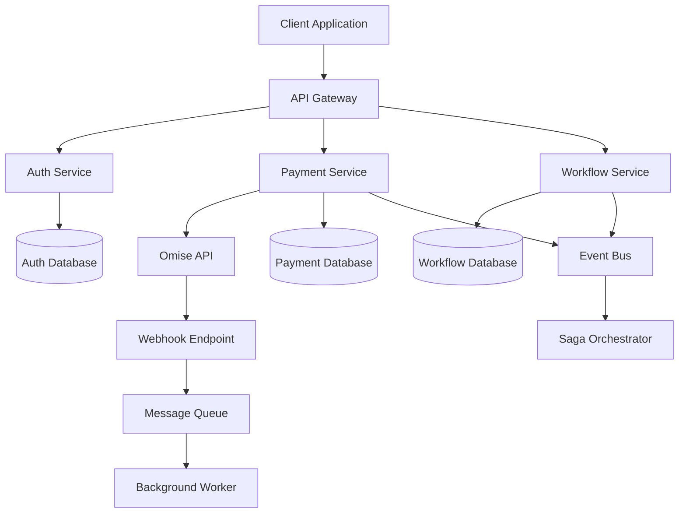
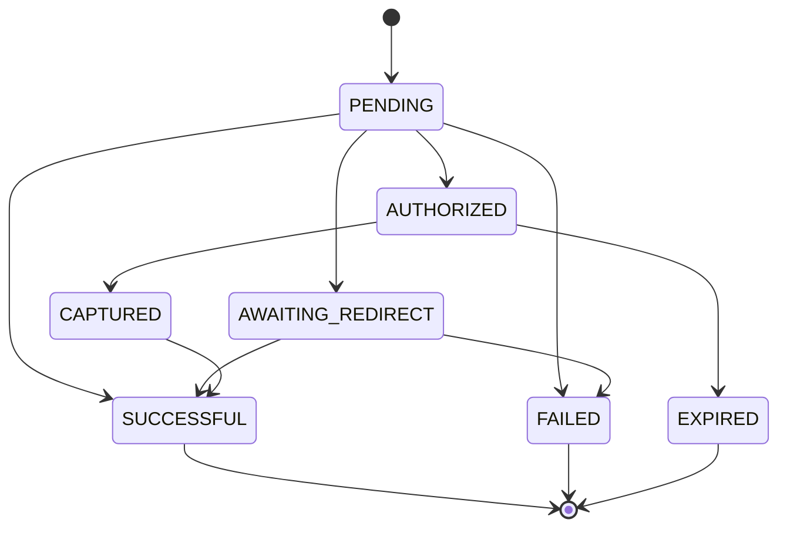
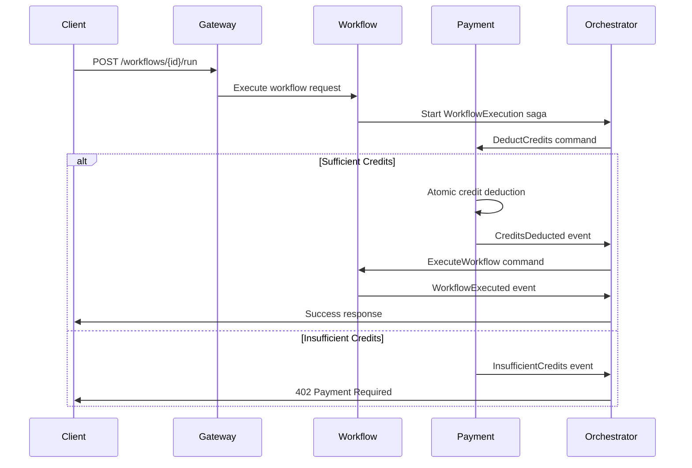

# Design Document

## Overview

The SaaS Credit & Monetization Engine is designed as a secure, production-ready microservice that implements a complete payment processing system using the Omise payment gateway. The architecture follows microservice design principles with strict service boundaries, database-per-service pattern, and event-driven communication for distributed transaction management.

The system serves as a plug-in architecture pattern that can be integrated into existing microservice ecosystems, demonstrating best practices for payment processing, security, and concurrency handling.

## Architecture

### High-Level Architecture



### Service Boundaries

The system is decomposed into three core microservices following the "Decompose by business capability" pattern:

1. **Authentication Service**: Manages user registration, login, and JWT token validation
2. **Payment Service**: Handles all payment processing, Omise integration, and credit management
3. **Workflow Service**: Manages user workflows and atomic credit consumption

### API Gateway Pattern

The API Gateway serves as the single entry point, providing:
- Request routing to appropriate services
- Authentication and authorization enforcement
- Rate limiting and throttling
- Request/response transformation
- Cross-cutting concerns centralization

## Components and Interfaces

### 1. Authentication Service

**Responsibilities:**
- User registration and login
- JWT token generation and validation
- Password hashing and security

**Key Interfaces:**
```python
class AuthServiceProtocol(Protocol):
    def register_user(self, email: str, password: str) -> UserResponse
    def authenticate_user(self, email: str, password: str) -> TokenResponse
    def validate_token(self, token: str) -> UserContext
```

**API Endpoints:**
- `POST /auth/register` - User registration
- `POST /auth/login` - User authentication
- `GET /auth/validate` - Token validation

### 2. Payment Service

**Responsibilities:**
- Exclusive Omise API integration
- Payment processing and charge lifecycle management
- Credit balance management
- Webhook processing and verification
- Idempotency layer implementation

**Key Interfaces:**
```python
class PaymentServiceProtocol(Protocol):
    def create_purchase(self, user_id: int, amount_thb: int, credits: int) -> PurchaseResponse
    def process_webhook(self, webhook_data: dict) -> WebhookResponse
    def get_user_credits(self, user_id: int) -> int
    def deduct_credits(self, user_id: int, amount: int) -> bool
```

**API Endpoints:**
- `POST /payments/purchase` - Initiate credit purchase
- `POST /webhooks/omise` - Omise webhook endpoint
- `GET /payments/credits/{user_id}` - Get user credit balance

**State Machine:**


### 3. Workflow Service

**Responsibilities:**
- Workflow management and ownership verification
- Atomic credit consumption
- Workflow execution coordination

**Key Interfaces:**
```python
class WorkflowServiceProtocol(Protocol):
    def create_workflow(self, user_id: int, name: str, credit_cost: int) -> WorkflowResponse
    def execute_workflow(self, user_id: int, workflow_id: int) -> ExecutionResponse
    def get_user_workflows(self, user_id: int) -> List[WorkflowResponse]
```

**API Endpoints:**
- `POST /workflows` - Create workflow
- `POST /workflows/{workflow_id}/run` - Execute workflow
- `GET /workflows` - Get user workflows

### 4. Saga Orchestrator

**Responsibilities:**
- Distributed transaction coordination
- Compensating transaction management
- Event-driven workflow orchestration

**Workflow Execution Saga:**


## Data Models

### Authentication Service Database

```python
class User(SQLModel, table=True):
    id: int | None = Field(default=None, primary_key=True)
    email: str = Field(unique=True, index=True)
    hashed_password: str
    created_at: datetime = Field(default_factory=datetime.utcnow)
    updated_at: datetime = Field(default_factory=datetime.utcnow)
```

### Payment Service Database

```python
class Purchase(SQLModel, table=True):
    id: int | None = Field(default=None, primary_key=True)
    user_id: int = Field(foreign_key="user.id", index=True)
    omise_charge_id: str | None = Field(unique=True, index=True)
    amount_thb: int
    credits_purchased: int
    status: str = Field(default="pending", index=True)
    payment_method_details: dict | None = Field(default=None, sa_column=Column(JSON))
    failure_code: str | None = None
    failure_message: str | None = None
    created_at: datetime = Field(default_factory=datetime.utcnow)
    updated_at: datetime = Field(default_factory=datetime.utcnow)

class UserCredit(SQLModel, table=True):
    id: int | None = Field(default=None, primary_key=True)
    user_id: int = Field(unique=True, index=True)
    credits: int = Field(default=0)
    updated_at: datetime = Field(default_factory=datetime.utcnow)

class IdempotencyKey(SQLModel, table=True):
    key: str = Field(primary_key=True)
    status_code: int
    response_body: dict = Field(sa_column=Column(JSON))
    created_at: datetime = Field(default_factory=datetime.utcnow)
```

### Workflow Service Database

```python
class Workflow(SQLModel, table=True):
    id: int | None = Field(default=None, primary_key=True)
    user_id: int = Field(index=True)
    name: str
    credit_cost: int = Field(default=100)
    created_at: datetime = Field(default_factory=datetime.utcnow)

class WorkflowExecution(SQLModel, table=True):
    id: int | None = Field(default=None, primary_key=True)
    workflow_id: int = Field(foreign_key="workflow.id")
    user_id: int = Field(index=True)
    credits_consumed: int
    status: str = Field(default="completed")
    executed_at: datetime = Field(default_factory=datetime.utcnow)
```

## Error Handling

### Standardized Error Response Format

```python
class ErrorResponse(BaseModel):
    error_code: str
    message: str
    details: List[dict] | None = None
    trace_id: str
    timestamp: datetime = Field(default_factory=datetime.utcnow)
```

### HTTP Status Code Usage

- **200 OK**: Successful GET, PUT, PATCH operations
- **201 Created**: Successful POST operations
- **204 No Content**: Successful DELETE operations
- **400 Bad Request**: Validation errors, malformed requests
- **401 Unauthorized**: Missing or invalid authentication
- **402 Payment Required**: Insufficient credits for workflow execution
- **403 Forbidden**: Valid authentication but insufficient permissions
- **404 Not Found**: Resource not found
- **409 Conflict**: Duplicate resource creation attempts
- **429 Too Many Requests**: Rate limiting exceeded
- **500 Internal Server Error**: Unexpected server errors

### Custom Exception Hierarchy

```python
class MonetizationEngineException(Exception):
    """Base exception for the monetization engine"""
    pass

class PaymentProcessingError(MonetizationEngineException):
    """Payment-related errors"""
    pass

class InsufficientCreditsError(MonetizationEngineException):
    """Insufficient credits for operation"""
    pass

class WebhookVerificationError(MonetizationEngineException):
    """Webhook verification failures"""
    pass

class WorkflowExecutionError(MonetizationEngineException):
    """Workflow execution failures"""
    pass
```

## Testing Strategy

### Security Testing Focus Areas

1. **Payment Touchpoints**:
   - Token validation and sanitization
   - Webhook signature verification
   - Credit balance manipulation prevention
   - SQL injection and input validation

2. **Authentication & Authorization**:
   - JWT token security
   - Password hashing verification
   - Access control enforcement

3. **API Endpoint Security**:
   - Rate limiting effectiveness
   - Input validation boundaries
   - Error message information leakage

### Concurrency Testing

1. **Payment Processing**:
   - Concurrent webhook processing
   - Race condition prevention in credit updates
   - Idempotency key collision handling

2. **Credit Consumption**:
   - Simultaneous workflow execution attempts
   - Atomic credit deduction verification
   - Database transaction isolation

### Test Categories

1. **Unit Tests**:
   - Individual service logic
   - Data model validation
   - Utility function testing

2. **Integration Tests**:
   - Service-to-service communication
   - Database operations
   - External API integration (Omise)

3. **End-to-End Tests**:
   - Complete user workflows
   - Payment processing flows
   - Error handling scenarios

4. **Performance Tests**:
   - Concurrent user simulation
   - Payment processing throughput
   - Database query optimization

### Test Implementation Strategy

```python
# Example test structure
class TestPaymentService:
    async def test_credit_purchase_flow(self):
        # Test complete credit purchase workflow
        pass
    
    async def test_webhook_verification(self):
        # Test webhook security and processing
        pass
    
    async def test_concurrent_credit_deduction(self):
        # Test race condition handling
        pass
    
    async def test_idempotency_layer(self):
        # Test duplicate request handling
        pass
```

## Security Considerations

### PCI DSS Compliance

1. **Client-Side Tokenization**: Raw cardholder data never touches application servers
2. **Secure Key Management**: Omise secret keys stored in dedicated secret management systems
3. **Network Segmentation**: Payment service deployed in isolated network segments
4. **Audit Logging**: Comprehensive logging of all payment-related activities

### Webhook Security

1. **Verification Process**:
   - Immediate webhook acknowledgment
   - Background verification with direct Omise API calls
   - Signature validation (if available)
   - IP whitelist enforcement

2. **Processing Pipeline**:
   ```mermaid
   graph LR
       Webhook[Webhook Received] --> Queue[Message Queue]
       Queue --> Worker[Background Worker]
       Worker --> Verify[Verify with Omise API]
       Verify --> Process[Process State Change]
       Process --> Update[Update Database]
   ```

### Idempotency Implementation

1. **Client-Generated Keys**: UUID v4 format for uniqueness
2. **Server-Side Storage**: Redis-based fast lookup with TTL
3. **Request Lifecycle**:
   - Check existing key
   - Store IN_PROGRESS status
   - Execute business logic
   - Store final result
   - Return cached response for retries

## Deployment Architecture

### Container Strategy

Each service deployed as independent Docker containers with:
- Health check endpoints
- Graceful shutdown handling
- Resource limits and monitoring
- Secret injection from external systems

### Database Strategy

- Separate PostgreSQL instances per service
- Connection pooling with asyncpg
- Database migrations with Alembic
- Backup and recovery procedures

### Message Queue

- Redis or RabbitMQ for event-driven communication
- Dead letter queues for failed message handling
- Message persistence and durability
- Consumer scaling based on queue depth

This design provides a robust, secure, and scalable foundation for the SaaS Credit & Monetization Engine, following microservice best practices while maintaining the flexibility to integrate with existing systems.