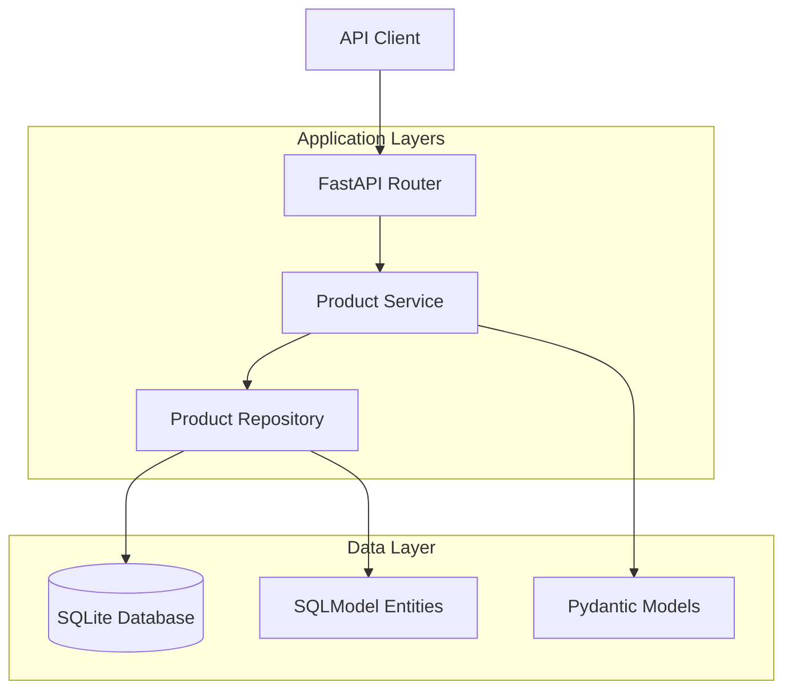

# Design Document: Basic Inventory Management API

## Overview

This design document outlines the architecture for a Basic Inventory Management API built with Python, following modern development practices with emphasis on type safety, separation of concerns, and atomic transaction handling. The system will use FastAPI for the web framework and SQLModel for database operations, providing a strongly-typed, declarative approach to API development.

The core focus is on **state management** - ensuring that product quantities remain accurate even under concurrent access patterns. This is achieved through atomic transactions and proper database constraints.

## Architecture

### High-Level Architecture



### Technology Stack

- **Web Framework:** FastAPI (declarative, type-safe API definitions)
- **Database ORM:** SQLModel (combines SQLAlchemy with Pydantic for type safety)
- **Database:** SQLite (simple, embedded database perfect for learning)
- **Type System:** Python 3.11+ with comprehensive type hints
- **Testing:** pytest with FastAPI test client

### Design Principles Applied

1. **Declarative & Data-Oriented:** FastAPI decorators define endpoints, SQLModel defines database schema
2. **Strongly Typed:** All functions, classes, and data structures use comprehensive type hints
3. **Separation of Concerns:** Clear layered architecture (API → Service → Repository → Database)
4. **Protocol-Based Interfaces:** Repository and service behaviors defined through protocols
5. **Atomic Operations:** Database transactions ensure state consistency

## Components and Interfaces

### 1. Data Models

#### SQLModel Entity (Database Layer)
```python
# This represents the actual database table structure
class Product(SQLModel, table=True):
    """
    Database model for products. SQLModel combines SQLAlchemy's ORM 
    capabilities with Pydantic's validation and serialization.
    
    Why SQLModel? It provides type safety at both the database and API levels,
    reducing the chance of runtime errors and serving as living documentation.
    """
    id: int | None = Field(default=None, primary_key=True)  # Auto-incrementing PK
    sku: str = Field(unique=True, index=True)  # Business identifier, indexed for performance
    name: str = Field(min_length=1, max_length=255)  # Required, reasonable length limit
    description: str | None = Field(default=None, max_length=1000)  # Optional field
    quantity: int = Field(ge=0)  # Must be >= 0, enforced at application level
    
    # Database constraint to prevent negative quantities - this is our safety net
    __table_args__ = (CheckConstraint('quantity >= 0', name='positive_quantity'),)
```

#### Pydantic Models (API Layer)
```python
# Request/Response models for API endpoints
class ProductCreate(BaseModel):
    """Input model for creating products. Separating this from the database model
    allows us to control exactly what fields the API accepts."""
    sku: str = Field(min_length=1, max_length=50, pattern=r'^[A-Z0-9\-]+$')
    name: str = Field(min_length=1, max_length=255)
    description: str | None = Field(default=None, max_length=1000)
    quantity: int = Field(ge=0, description="Initial stock quantity")

class StockOperation(BaseModel):
    """Model for stock add/remove operations. Using a dedicated model makes
    the API contract clear and enables validation."""
    amount: int = Field(gt=0, description="Amount to add or remove (must be positive)")

class ProductResponse(BaseModel):
    """Response model that matches our database entity but can be customized
    for API responses without affecting the database schema."""
    sku: str
    name: str
    description: str | None
    quantity: int
```

### 2. Repository Layer (Data Access)

#### Repository Protocol
```python
class ProductRepositoryProtocol(Protocol):
    """
    Protocol defining the contract for product data access.
    
    Why use Protocol? It allows us to easily swap implementations
    (e.g., from SQLite to PostgreSQL) without changing business logic.
    This follows the Dependency Inversion Principle.
    """
    async def create_product(self, product_data: ProductCreate) -> Product: ...
    async def get_all_products(self) -> list[Product]: ...
    async def get_product_by_sku(self, sku: str) -> Product | None: ...
    async def add_stock_atomic(self, sku: str, amount: int) -> Product | None: ...
    async def remove_stock_atomic(self, sku: str, amount: int) -> Product | None: ...
```

#### SQLModel Repository Implementation
```python
class SQLModelProductRepository:
    """
    Concrete implementation using SQLModel/SQLAlchemy.
    
    This class handles all database operations and implements the critical
    atomic transaction logic for stock operations.
    """
    
    def __init__(self, session: AsyncSession):
        self.session = session
    
    async def remove_stock_atomic(self, sku: str, amount: int) -> Product | None:
        """
        The critical method that implements atomic stock removal.
        
        This demonstrates the read-check-update pattern within a transaction:
        1. Start transaction (handled by session context)
        2. Read current quantity with SELECT FOR UPDATE (prevents other transactions from modifying)
        3. Check if we have enough stock
        4. Update if check passes
        5. Commit or rollback based on success
        """
        # SELECT FOR UPDATE locks the row until transaction completes
        stmt = select(Product).where(Product.sku == sku).with_for_update()
        result = await self.session.execute(stmt)
        product = result.scalar_one_or_none()
        
        if not product:
            return None
            
        # Critical check: ensure we don't go negative
        if product.quantity < amount:
            # Don't modify anything, let the service layer handle the error
            return None
            
        # Safe to update
        product.quantity -= amount
        await self.session.commit()
        return product
```

### 3. Service Layer (Business Logic)

#### Service Protocol
```python
class ProductServiceProtocol(Protocol):
    """
    Business logic interface. This layer handles validation,
    error handling, and coordinates repository operations.
    """
    async def create_product(self, product_data: ProductCreate) -> ProductResponse: ...
    async def get_all_products(self) -> list[ProductResponse]: ...
    async def get_product_by_sku(self, sku: str) -> ProductResponse: ...
    async def add_stock(self, sku: str, amount: int) -> ProductResponse: ...
    async def remove_stock(self, sku: str, amount: int) -> ProductResponse: ...
```

### 4. API Layer (FastAPI Routes)

```python
@router.post("/products", status_code=201, response_model=ProductResponse)
async def create_product(
    product_data: ProductCreate,
    service: ProductServiceProtocol = Depends(get_product_service)
) -> ProductResponse:
    """
    Creates a new product.
    
    Why POST? POST is for creating new resources. The server assigns the ID.
    Why 201? 201 Created indicates successful resource creation.
    """
    return await service.create_product(product_data)

@router.patch("/products/{sku}/remove", response_model=ProductResponse)
async def remove_stock(
    sku: str,
    operation: StockOperation,
    service: ProductServiceProtocol = Depends(get_product_service)
) -> ProductResponse:
    """
    Removes stock from a product.
    
    Why PATCH? We're partially updating the resource (just the quantity).
    The atomic transaction logic in the repository ensures this is safe.
    """
    return await service.remove_stock(sku, operation.amount)
```

## Data Models

### Database Schema

```sql
-- SQLModel will generate this schema automatically
CREATE TABLE product (
    id INTEGER PRIMARY KEY AUTOINCREMENT,
    sku VARCHAR(50) NOT NULL UNIQUE,
    name VARCHAR(255) NOT NULL,
    description VARCHAR(1000),
    quantity INTEGER NOT NULL,
    CONSTRAINT positive_quantity CHECK (quantity >= 0)
);

-- Index on SKU for fast lookups (SQLModel creates this automatically)
CREATE INDEX ix_product_sku ON product (sku);
```

### Key Design Decisions

1. **Separate ID and SKU:** 
   - `id`: Auto-incrementing primary key for database efficiency
   - `sku`: Business identifier that users interact with
   - This allows changing SKUs without breaking relationships

2. **Quantity Constraints:**
   - Application-level validation in Pydantic models
   - Database-level CHECK constraint as safety net
   - Atomic transactions prevent race conditions

3. **Type Safety:**
   - All models use comprehensive type hints
   - Pydantic validation catches errors early
   - SQLModel ensures database and API types stay in sync

## Error Handling

### HTTP Status Code Strategy

```python
class InventoryException(Exception):
    """Base exception for inventory operations"""
    pass

class ProductNotFound(InventoryException):
    """Raised when product doesn't exist - maps to 404"""
    pass

class InsufficientStock(InventoryException):
    """Raised when trying to remove more stock than available - maps to 400"""
    pass

class DuplicateSKU(InventoryException):
    """Raised when trying to create product with existing SKU - maps to 400"""
    pass

# FastAPI exception handlers convert these to appropriate HTTP responses
@app.exception_handler(ProductNotFound)
async def product_not_found_handler(request: Request, exc: ProductNotFound):
    return JSONResponse(
        status_code=404,
        content={"error": "Product not found", "detail": str(exc)}
    )
```

### Transaction Error Handling

```python
async def remove_stock_with_error_handling(self, sku: str, amount: int) -> Product:
    """
    Demonstrates proper transaction error handling.
    
    The key insight: let the database transaction handle rollbacks automatically.
    Our job is to detect the business logic errors and respond appropriately.
    """
    try:
        async with self.session.begin():  # Auto-commit/rollback context
            product = await self.remove_stock_atomic(sku, amount)
            if not product:
                raise InsufficientStock(f"Cannot remove {amount} items from {sku}")
            return product
    except SQLAlchemyError as e:
        # Database-level errors (constraint violations, connection issues)
        raise InventoryException(f"Database error: {str(e)}")
```

## Testing Strategy

### Test Structure

```python
# Test the critical atomic operations
@pytest.mark.asyncio
async def test_concurrent_stock_removal():
    """
    Tests that concurrent stock removal operations don't cause race conditions.
    
    This test simulates the scenario described in the assignment:
    Two customers trying to buy the last item simultaneously.
    """
    # Setup: Create product with quantity 1
    product = await create_test_product(sku="TEST-001", quantity=1)
    
    # Simulate concurrent requests
    async def remove_stock_task():
        return await product_service.remove_stock("TEST-001", 1)
    
    # Run two removal operations concurrently
    results = await asyncio.gather(
        remove_stock_task(),
        remove_stock_task(),
        return_exceptions=True
    )
    
    # Verify: One succeeds, one fails with InsufficientStock
    success_count = sum(1 for r in results if not isinstance(r, Exception))
    assert success_count == 1, "Only one operation should succeed"
    
    # Verify final state
    final_product = await product_service.get_product_by_sku("TEST-001")
    assert final_product.quantity == 0, "Final quantity should be 0"
```

### Integration Tests

```python
@pytest.mark.asyncio
async def test_api_endpoints_integration():
    """Test the complete API workflow"""
    async with AsyncClient(app=app, base_url="http://test") as client:
        # Create product
        response = await client.post("/products", json={
            "sku": "TSHIRT-RED-L",
            "name": "Red T-Shirt (Large)",
            "quantity": 10
        })
        assert response.status_code == 201
        
        # Remove stock
        response = await client.patch("/products/TSHIRT-RED-L/remove", json={
            "amount": 3
        })
        assert response.status_code == 200
        assert response.json()["quantity"] == 7
        
        # Try to remove too much stock
        response = await client.patch("/products/TSHIRT-RED-L/remove", json={
            "amount": 10
        })
        assert response.status_code == 400
```

## Project Structure

```
inventory_api/
├── main.py                 # FastAPI application entry point
├── models/
│   ├── __init__.py
│   ├── database.py         # SQLModel entities
│   └── api.py             # Pydantic request/response models
├── repositories/
│   ├── __init__.py
│   ├── protocols.py        # Repository interfaces
│   └── sqlmodel.py        # SQLModel implementations
├── services/
│   ├── __init__.py
│   ├── protocols.py        # Service interfaces
│   └── product.py         # Business logic implementation
├── api/
│   ├── __init__.py
│   ├── dependencies.py     # FastAPI dependency injection
│   └── routes.py          # API endpoint definitions
├── core/
│   ├── __init__.py
│   ├── config.py          # Application configuration
│   ├── database.py        # Database connection setup
│   └── exceptions.py      # Custom exception definitions
└── tests/
    ├── __init__.py
    ├── conftest.py         # Test configuration and fixtures
    ├── test_repositories.py
    ├── test_services.py
    └── test_api.py
```

This structure follows the separation of concerns principle from your style guide, with each layer having a clear responsibility and well-defined interfaces between them.