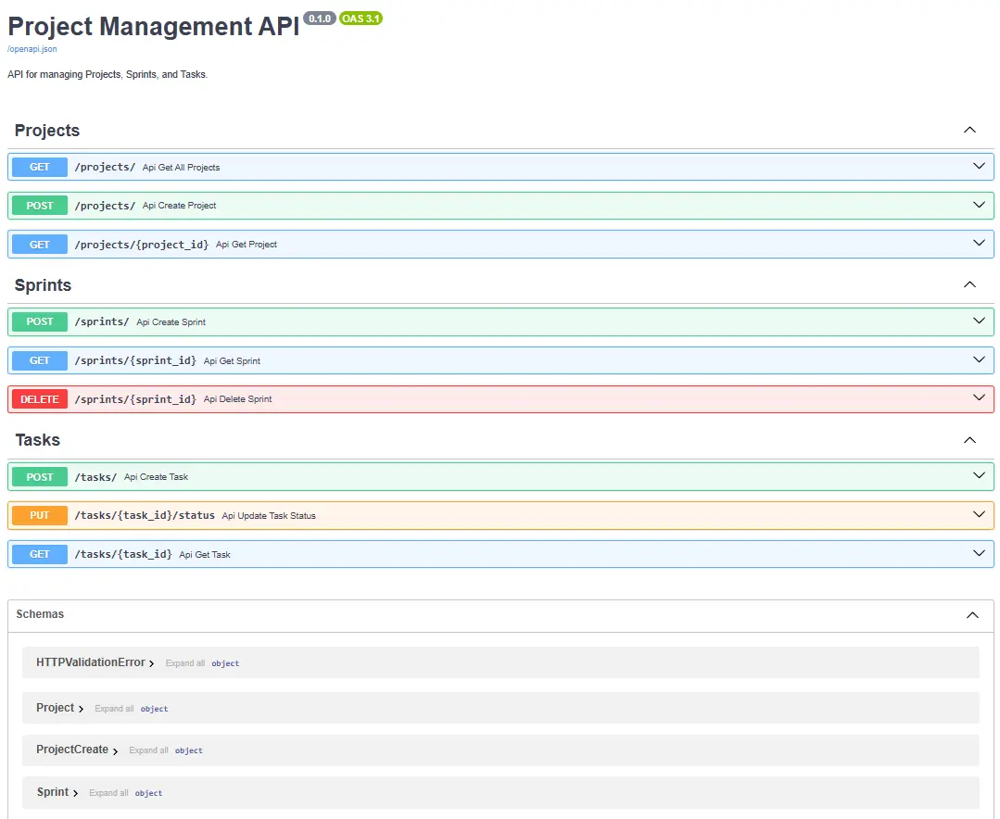

# Projects Management API

[](https://fastapi.tiangolo.com/)
[](https://sqlmodel.tiangolo.com/)
[](https://www.python.org/)

## ⚡ The Blueprint

"...Its clean separation of concerns aims to provide a welcoming and clear structure, so any developer can get up to speed quickly and contribute with confidence."



This is a three-tier project management API that manages:

-   **Projects (top level)**
-   **Sprints (related projects)**
-   **Tasks (related sprints)**

The core philosophy behind this project is **separation of concerns**, where each part of the application has one clear responsibility:

-   **API Layer (`main.py`):** The "front door." Its only job is to handle web requests and errors.
-   **Operation Logic Layer (`src/crud.py`):** The "brain." It contains all the logic for how to create, read, update, and delete data.
-   **Data Model Layer (`src/models.py`):** The "foundation." It defines the shape and relationships of the data in the database.

This design emphasizes maintainability and scalability for sustainable software development.

## 🗃️ Architectural & Technical Highlights

This project's codebase is a practical implementation of the following key concepts:

-   **Clean Architecture:** Features a clear separation.
-   **Relational Data Modeling:** Implements a three-level database hierarchy (`Project` -> `Sprint` -> `Task`) to represent a real-world structure.
-   **Full CRUD Implementation:** Provides complete Create, Read, Update, and Delete operations for all data models.
-   **API Design:** Utilizes Pydantic schemas for request validation, `response_model` for controlled output, and `HTTPException` for standard-based error handling.
-   **Type-Safe Python:** Leverages modern Python typing features for clear, reliable, and self-documenting code.

## 🧩 API Endpoints

The API provides a complete set of endpoints for managing the data hierarchy.

| Method   | Endpoint                  | Description                        |
| :------- | :------------------------ | :--------------------------------- |
| `POST`   | `/projects/`              | Create a new project.              |
| `GET`    | `/projects/`              | Get a list of all projects.        |
| `GET`    | `/projects/{project_id}`  | Get details for a single project.  |
| `POST`   | `/sprints/`               | Create a new sprint for a project. |
| `GET`    | `/sprints/{sprint_id}`    | Get details for a single sprint.   |
| `DELETE` | `/sprints/{sprint_id}`    | Delete a sprint.                   |
| `POST`   | `/tasks/`                 | Create a new task.                 |
| `GET`    | `/tasks/{task_id}`        | Get details for a single task.     |
| `PUT`    | `/tasks/{task_id}/status` | Update the status of a task.       |

## 🚦 Getting Started

### Prerequisites

-   Python 3.10+
-   An active virtual environment is recommended.

### Installation & Setup

1.  **Clone the repository:**

    ```bash
    git clone <your-repo-url>
    cd coreflow-api
    ```

2.  **Create and activate a virtual environment:**

    ```bash
    python -m venv .venv
    source .venv/bin/activate  # On Windows: .venv\Scripts\activate
    ```

3.  **Install dependencies:**
    ```bash
    pip install -r requirements.txt
    ```

### Running the Application

1.  **Start the API server:**

    ```bash
    uvicorn main:app --reload
    ```

2.  **Access the interactive documentation:**
    After the server is running, you will see **` 🕹️ API Documentation: http://127.0.0.1:8000/docs`**. From here, you can interact with all the API endpoints.
